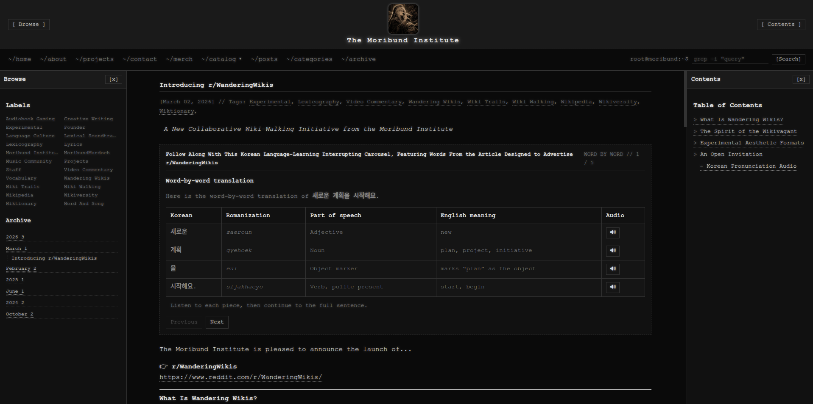

# Moribund Institute Blogger Theme



A terminal-styled Blogger theme and page-template collection for **The Moribund Institute**.

This repository stores the live Blogger XML export, reusable theme fragments, page HTML, CSS source files, documentation, and screenshots for the Moribund Institute Blogger site. The theme is designed around a dark terminal/workspace interface with collapsible side panels, command-line search, Blogger label/archive navigation, generated table of contents support, and project hub pages.

## Status

This is an active work-in-progress theme repository.

The current structure is being split into readable source parts so the Blogger XML does not become the only place where important code lives.

## Features

- **Terminal workspace layout**  
  A dark, monochrome Blogger interface with a header, central reading canvas, left Browse panel, and right Contents panel.

- **Collapsible side panels**  
  Browse and Contents panels can be opened/closed from the header or panel controls.

- **Responsive mobile behavior**  
  On smaller screens, the side panels become slide-in overlays instead of permanently occupying the page.

- **Command-line search bar**  
  Blogger search is styled like a terminal prompt.

- **Blogger-native labels and archive widgets**  
  The left panel supports Blogger labels and archive navigation.

- **Generated table of contents support**  
  The right panel can build a contents list from headings in the current post or page.

- **Custom post styling**  
  Posts use terminal-style titles, metadata, tags, code blocks, images, and pagination.

- **Footer link directories**  
  Footer sections can point to social links, wiki resources, project links, tools, and source code.

- **Reusable page templates**  
  The repository is organized to support both live Blogger pages and reusable template pages.

- **Live XML plus template XML**  
  The actual Blogger export lives separately from the future cleaned public template version.

## Repository Structure

```text
.
├── css/
│   ├── full-theme.css
│   ├── page-styles/
│   │   ├── archive-page.css
│   │   ├── catalog-page.css
│   │   └── wandering-wikis-page.css
│   └── sections/
│
├── docs/
│   ├── install-blogger-theme.md
│   ├── labels-and-categories.md
│   ├── repository-map.md
│   └── wandering-wikis-link-map.md
│
├── pages/
│   ├── live/
│   │   ├── projects/
│   │   ├── subjects/
│   │   │   ├── 000-general-works.html
│   │   │   ├── 100-philosophy.html
│   │   │   ├── 200-religion.html
│   │   │   ├── 300-social-science.html
│   │   │   ├── 400-language.html
│   │   │   ├── 500-pure-science.html
│   │   │   ├── 600-applied-sciences.html
│   │   │   ├── 700-arts-and-recreation.html
│   │   │   ├── 800-literature.html
│   │   │   └── 900-history-and-geography.html
│   │   └── system/
│   │       ├── archive.html
│   │       └── categories.html
│   └── templates/
│       ├── archive-template.html
│       ├── categories-template.html
│       ├── project-page-template.html
│       └── subject-page-template.html
│
├── screenshots/
│   └── homepage-work-in-progress-2024-10-17.png
│
├── theme-parts/
│   ├── live/
│   │   ├── footer.html
│   │   ├── header.html
│   │   └── scripts.html
│   └── templates/
│       ├── footer-template.html
│       ├── header-template.html
│       └── scripts-template.html
│
├── xml/
│   ├── live/
│   │   └── moribund-institute-live.xml
│   └── templates/
│       └── moribund-institute-template.xml
│
├── LICENSE
└── README.md
```

## Important Folders

### `xml/live/`

Contains the actual exported Blogger XML currently used by the Moribund Institute Blogger theme.

Current live export:

```text
xml/live/moribund-institute-live.xml
```

### `xml/templates/`

Reserved for cleaned, reusable Blogger XML templates. These should remove or replace site-specific links, images, widgets, and account-specific details.

### `theme-parts/live/`

Extracted pieces from the live Blogger XML, such as:

```text
theme-parts/live/header.html
theme-parts/live/footer.html
theme-parts/live/scripts.html
```

These are meant to make editing easier without digging through the full Blogger XML every time.

### `theme-parts/templates/`

Reusable versions of the header, footer, and scripts with placeholders instead of Moribund Institute-specific links.

### `pages/live/`

HTML used for actual Blogger pages.

Examples:

```text
pages/live/subjects/000-general-works.html
pages/live/system/archive.html
pages/live/system/categories.html
```

### `pages/templates/`

Reusable page skeletons for future Blogger pages.

Examples:

```text
pages/templates/subject-page-template.html
pages/templates/project-page-template.html
```

### `css/`

Theme CSS and page-specific CSS.

The long-term goal is to keep `css/full-theme.css` as the assembled readable source and split major parts into `css/sections/`.

### `docs/`

Notes for installing, editing, and maintaining the theme.

### `screenshots/`

Reference images for the README and documentation.

## Installation

To install the live theme on Blogger:

1. Go to your Blogger dashboard.
2. Open **Theme**.
3. Use **Backup / Restore** or **Edit HTML**, depending on your Blogger interface.
4. Upload or paste:

```text
xml/live/moribund-institute-live.xml
```

5. Save the theme.
6. Review the site on desktop and mobile.

Before replacing an existing Blogger theme, always download a backup from Blogger first.

## Editing Workflow

The recommended workflow is:

1. Edit readable source files in this repository.
2. Copy the relevant changes into the Blogger XML.
3. Test in Blogger preview.
4. Export the updated Blogger XML.
5. Save the new export back into:

```text
xml/live/moribund-institute-live.xml
```

6. Commit the changes.

Example:

```bash
git status
git add .
git commit -m "Update Blogger theme header"
git push
```

## Blogger Pages

Live Blogger page HTML belongs in:

```text
pages/live/
```

Reusable page skeletons belong in:

```text
pages/templates/
```

Subject pages are organized by broad Dewey-style categories:

```text
000 General Works
100 Philosophy
200 Religion
300 Social Science
400 Language
500 Pure Science
600 Applied Sciences
700 Arts and Recreation
800 Literature
900 History and Geography
```

## Wandering Wikis

Wandering Wikis is a Moribund Institute project with its own external presence.

Related links may include:

- Moribund Institute Blogger page
- Wandering Wikis Blogger
- Official MediaWiki site
- YouTube
- Reddit
- Lemmy
- SoundCloud
- Bandcamp
- Redbubble

Project-specific notes belong in:

```text
docs/wandering-wikis-link-map.md
pages/live/projects/
css/page-styles/wandering-wikis-page.css
```

## Labels and Categories

Blogger labels are used as category-like archives.

Example label URLs:

```text
/search/label/Wandering%20Wikis
/search/label/Wiki%20Walking
/search/label/Wiki%20Trails
/search/label/Lexicography
/search/label/Video%20Commentary
```

Use consistent label spelling. Blogger treats differently spelled labels as different archives.

Good:

```text
Wandering Wikis
Wiki Walking
Wiki Trails
```

Avoid mixing these unless intentionally separate:

```text
WanderingWikis
Wandering Wikis
wandering-wikis
```

## Design Notes

The theme uses a dark terminal-inspired visual language:

- black/dark panel backgrounds
- light monospace text
- subtle glow effects
- dotted and dashed borders
- terminal prompt search
- directory-style footer labels
- collapsible system panels
- Blogger-native widgets styled as terminal navigation

The goal is not to look like a generic magazine blog. The goal is to feel like a self-directed learning terminal for the Moribund Institute.

## Current Live Theme

The main live Blogger XML is:

```text
xml/live/moribund-institute-live.xml
```

That file is the importable Blogger theme.

The rest of the repository is the source kit used to make the theme easier to understand and maintain.

## Contributing

Contributions are welcome, especially for:

- improving Blogger XML structure
- cleaning reusable templates
- improving responsive behavior
- adding page templates
- improving documentation
- fixing broken links
- improving accessibility
- making the theme easier to reuse

Basic workflow:

```bash
git checkout -b feature/my-change
git add .
git commit -m "Describe the change"
git push
```

Then open a pull request.

## License

This project is licensed under the MIT License.

See:

```text
LICENSE
```

The theme may be used, modified, and redistributed as long as the license is preserved.
